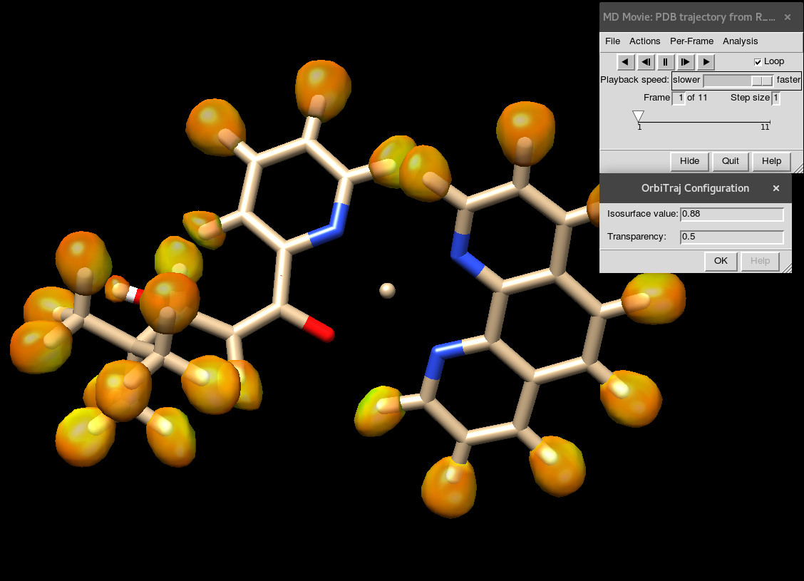

# OrbiTraj

A subtle modification to UCSF Chimera's MD Movie extension
to allow the visualization of volumetric data along a molecular
trajectory. 

It works by patching the original MD Movie and injecting new
hooks to open and display the volume surfaces. 

## Features

There's only one:

- Load a volume file for each frame, in every format supported by Chimera. 
- If you download [Multiwfn](http://sobereva.com/multiwfn/) separately, it will also convert wavefunction files for you automatically.

## Disclaimer

While the original MD Movie extension is meant to load and play
molecular dynamics simulation, which can be very long, this
modification should be used with care: loading a volume for each
frame is not very RAM-friendly... :)

The original intention of this tool is to create animation 
of electron density along a QM optimization or scan, but maybe
you can use it for other purposes.

## Other goodies

Together with the extension, a couple of scripts are included:

- `com2xyz.py`: converts Gaussian input files (.com) to simple xyz files, so you can display the trajectory with MD Movie XYZ native support.
- `wfnmovie.py`: converts wfn to cub/pdb pairs, loads them into Chimera and generates a movie out of it. You should probably create a copy and edit the commands to achieve a good point of view. If specified, the movie won't be generated so you can use it as a batch WFN converter suitable for MD Movie visualization. This especially useful if the number of wfn files is large.